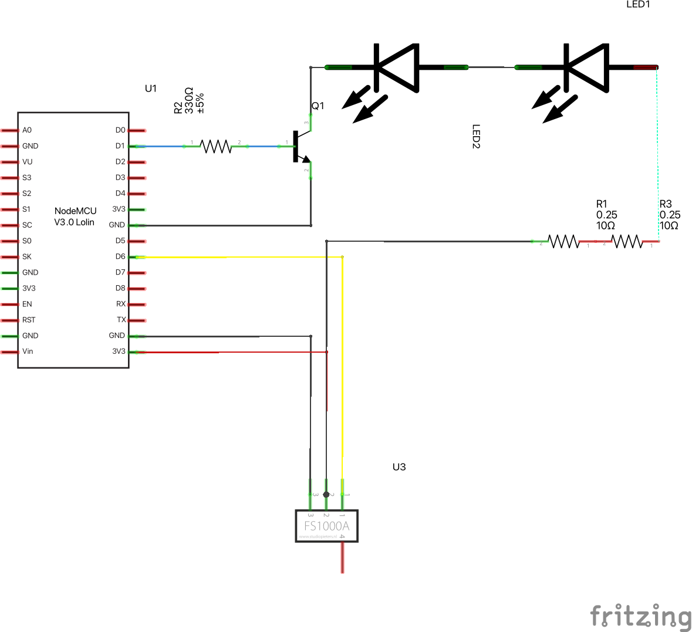
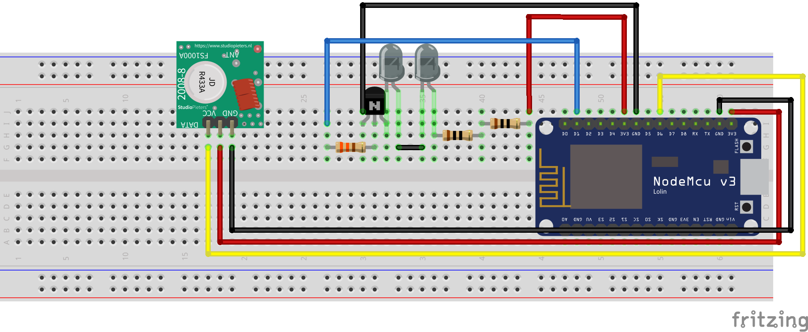

# HiFiWiFi
An ESP8266 based system to remote controll or smart control my hifi system via Webinterface or Home Assistant (MQTT)

My Hifi System consists of a Majority Snowdon 2 Soundbar (IR Controlled), an Acer P5530 Beamer (IR Controlled) and an ESmart Screen with motor (RC 433MHZ Controlled).

Simply used 2 IR LEDs in 2 different directions to control the soundbar and beamer. The screen is controlled via 433 MHZ sender.

The Repo contains the code for the ESP and additionally an .fz file for the tool "Fritzing", this contains the buildplan for the System.

Additionally, since I used some added parts in fritzing, I also added 2 pictures.

